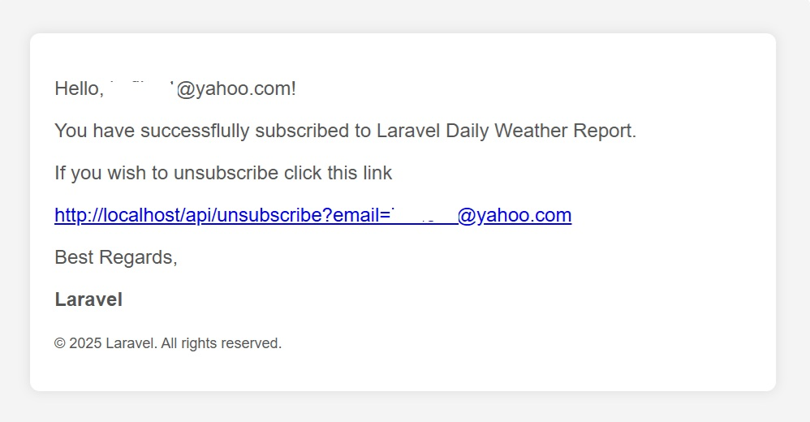
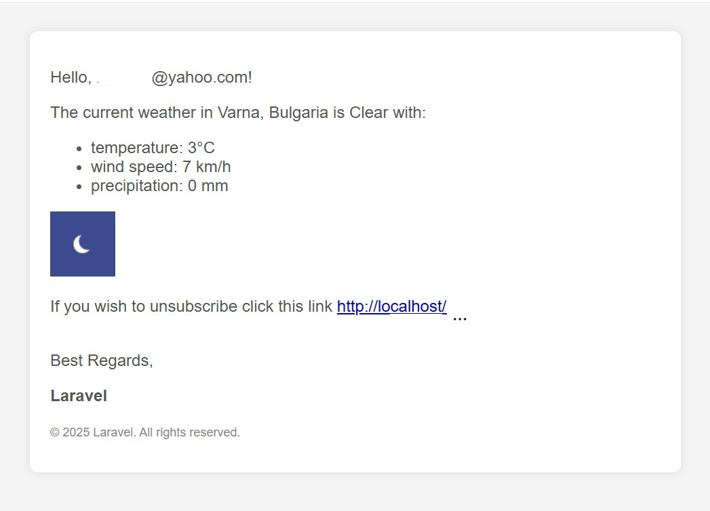

# Laravel email subscription service App for automatic weather reports

This is a simple weather subscription service built with Laravel 12 that lets users subscribe to the service trough API (using get requests) and receive everyday weather reports by email. The app uses weatherstack.com to retrive weather data but can easily be configured to use any other service.

## Requirements

Web `server` like Apache, nginx or XAMPP with `PHP 8.2` and `MySQL`. Also install `composer` and `artisan` (if you install Laravel globaly from the Laravel Installer this will include artisan for your system).

## Configuration

Run in console:

`composer install` to install the PHP dependancies in vendor folder

`npm install` to install the JS dependancies in node_modules folder

Configure your .env file.

```
MAIL_MAILER=smtp
MAIL_HOST=sandbox.smtp.mailtrap.io
MAIL_PORT=2525
MAIL_USERNAME=....
MAIL_PASSWORD=....

#additional stuff
WEATHERSTACK_ADDRESS=https://api.weatherstack.com
WEATHERSTACK_API_KEY=....
```

`php artisan key:generate` to generate encryption key for Laravel

`php artisan migrate` to create the database

## Running the app

Make sure you have your server, php and mysql running (Latest XAMPP for example). Then make sure you see the Laravel 12 homepage on the browser by visiting `http://localhost`.

## Subscribtion

To subscibe go to: `/api/subscribe?email=your@email.com&location=your_location_or_coordinates`

For example: `/api/subscribe?email=your@email.com&location=sofia`

or with coordinates: `/api/subscribe?email=your@email.com&location=40.7831,-73.9712`

After you subscribe you should receive an email confirming your subscribtion and a link to unsubscribe.

To unsubscribe go to: `/api/unsubscribe?email=your@email.com`

For more realistic scenario an encrypted key for each user may be included in the unsubscribe link.

## Tests

One additional test file (WeatherAPITest.php) is included in the tests/Feature directory. WeatherAPITest.php does HTTP tests for the API subscribe and unsubscribe endpoints using PHPUnit.

To run the tests execute `php artisan test` in the console.

For tests to pass the `APP_URL` .env variable should point to `http://localhost`. If changing the .env or other configurations make sure to execute `php artisan config:clear` before running tests.

## Database structure

The app uses MySQL database with one additional table for the email subscribers that holds the email and location for each subscriber. It uses soft deletes for deactivation of subscription. When the user unsubscribe himself he gets hard deleted from the database. 

For more advanced app more DB tables can be used. If we need to enable users subscribe to multiple locations, then we will need one table for the subscriber emails, another table for the locations and one pivot table for the many-to-many relation between emails and locations. 

To run the migrations execute in the console:

`php artisan migrate`

## Sending the welcome emails to subscribers

To send the welcome emails to subscribers we use queue worker. To run the queue:

`php artisan queue:work`

## Sending the weather report emails

We use task scheduling to send the weather reports daily. For local development we can run the schedule for sending weather reports like this:

`php artisan schedule:work`

The schedule is defined in the routes/console.php file. To test if the emails are coming you can change `daily` function to `everyMinute`.

The logic for sending the weather report emails is here: `app\Console\Commands\SendWeatherReportEmails.php`

**TODOs**

In real world we may have a lot of subscribers. In such a case we may need to use queue job for each email with a weather report and then use the schedule to start executing the queue. In such a case we would be able to rerun the qieue for the failed emails.

## Emails

Email design is done by blade and views are located in resources/views/email folder.





## License

The Laravel framework is open-sourced software licensed under the [MIT license](https://opensource.org/licenses/MIT).

